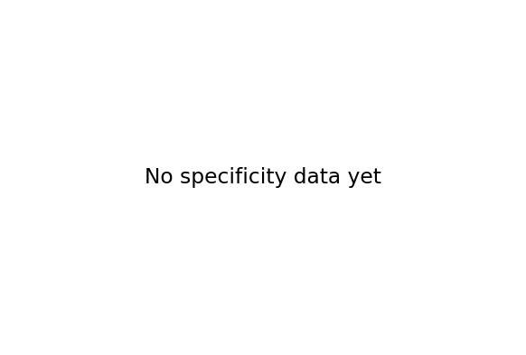
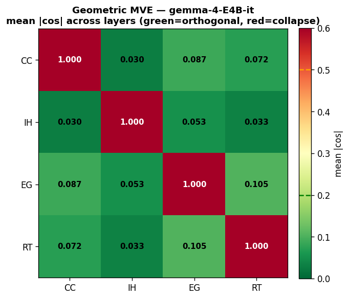
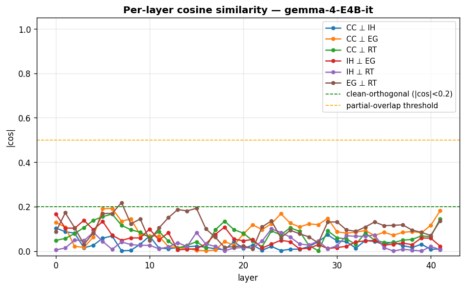
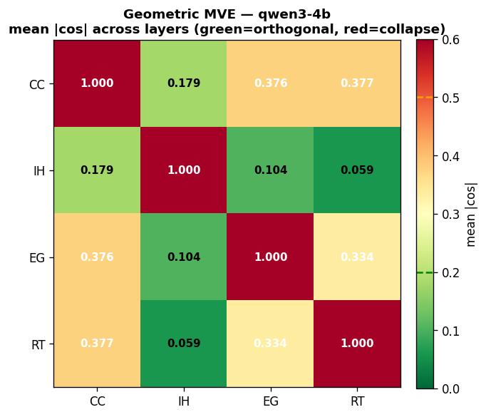
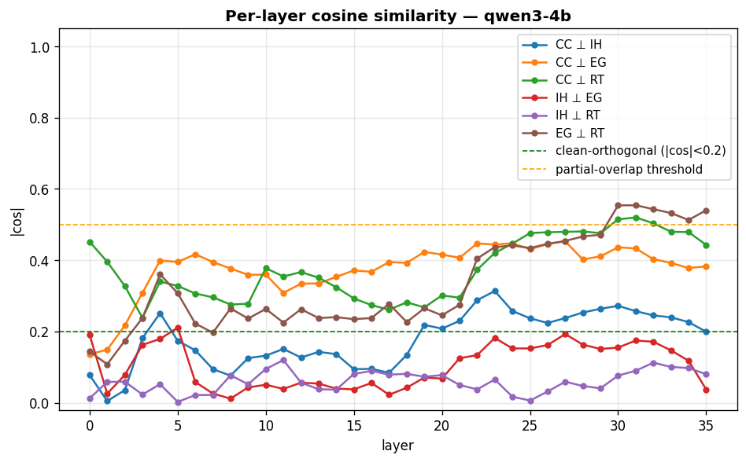

# Phronesis — EG + RT specificity matrix analysis

*Generated 2026-04-25 01:15 UTC*

## Overall verdict: ⏳ **NO DATA YET**

Per F98 pre-registration (`docs/findings.md`) and exit criteria in `docs/eg-rt-eval-spec.md` §5.7.

## Behavioral (4×4 specificity matrix)

**Verdict:** ⏳ **NO DATA YET**

### Per-cell deltas

*(no specificity data yet — run specificity_matrix.py first)*

## Geometric MVE (pairwise orthogonality)

- **gemma-4-E4B-it**: 6/6 pairs pass (expected 6) → ✅ **ALL CLEAN**

#### gemma-4-E4B-it

| pair | mean \|cos\| | max \|cos\| | mean retention | verdict |
|---|---|---|---|---|
| CC ⊥ IH | 0.0302 | 0.1036 | 99.9% | 🟢 pass |
| CC ⊥ EG | 0.0872 | 0.1920 | 99.5% | 🟢 pass |
| CC ⊥ RT | 0.0718 | 0.1666 | 99.7% | 🟢 pass |
| IH ⊥ EG | 0.0532 | 0.1668 | 99.8% | 🟢 pass |
| IH ⊥ RT | 0.0333 | 0.0998 | 99.9% | 🟢 pass |
| EG ⊥ RT | 0.1045 | 0.2179 | 99.3% | 🟢 pass |

- **qwen3-4b**: 3/6 pairs pass (expected 6) → ❌ **COLLAPSE**

#### qwen3-4b

| pair | mean \|cos\| | max \|cos\| | mean retention | verdict |
|---|---|---|---|---|
| CC ⊥ IH | 0.1787 | 0.3136 | 98.1% | 🟢 pass |
| CC ⊥ EG | 0.3756 | 0.4530 | 92.4% | 🟡 partial |
| CC ⊥ RT | 0.3766 | 0.5201 | 92.2% | 🟡 partial |
| IH ⊥ EG | 0.1038 | 0.2108 | 99.3% | 🟢 pass |
| IH ⊥ RT | 0.0588 | 0.1198 | 99.8% | 🟢 pass |
| EG ⊥ RT | 0.3343 | 0.5543 | 93.2% | 🟡 partial |

## Caveats

- **Scorer false-positive risk** (per `docs/scoring.md` FM-6): deficiency-non-virtuous passages using evidence vocabulary while making confident-causation claims can score as EG-virtuous. Hand review corrects.
- **Technical-jargon false negative** (FM-7): chemistry/engineering prose may be under-scored by EG regex. Affects absolute magnitudes more than the relative effects measured here.
- **Cross-source length variance**: ChatGPT batch-2 triplets are ~180w vs Sonnet ~230-290w. Within-triad lengths are matched (±10% per triplet per `LEDGER.md`), so intra-cell direction is clean; absolute score magnitudes may vary by source.
- **Pre-registration**: all thresholds in `config.yaml` were committed before any data existed (F98). Verdicts are computed mechanically, not tuned post-hoc.

## Provenance

- Config: `mvp/analysis/config.yaml`

- Raw specificity data: `results/specificity_matrix/all_generations_*.csv`

- Extracted vectors: `results/vectors/{model}/{corpus}/{method}/`

- Source documents: `docs/mvp-virtues.md`, `docs/eg-rt-eval-spec.md`, `docs/findings.md` F98
